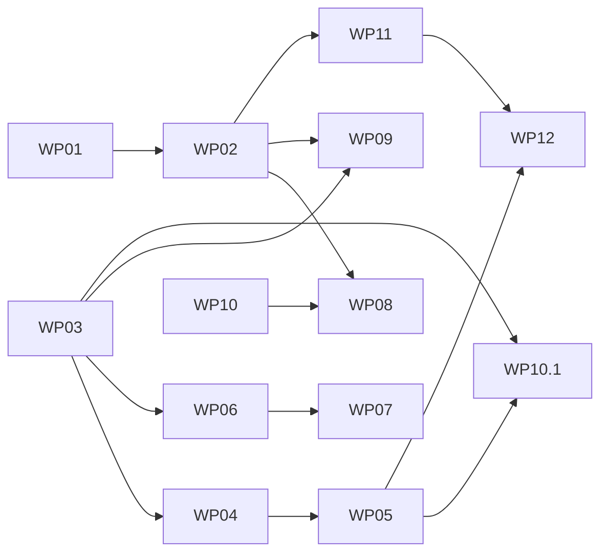

# Plan: VeyraN Mac Catalyst → Apple-typische macOS-App

Reihenfolge = empfohlene Abarbeitung. Ein Paket pro Session. Pakete ohne gegenseitige Abhängigkeit können parallel laufen (WP01, WP03, WP10).

| # | Paket | Befunde | Aufwand | Abhängig von | Status |
|---|---|---|---|---|---|
| 1 | [WP01 · Sichtbare Laufzeit-Fehler beheben](packages/WP01-runtime-bugs.md) | 8 (P1×5 · P2×2 · P3×1) | S | — | erledigt (R18 Toolbar, R20 offen) |
| 2 | [WP02 · Ein Toolbar-Band statt drei Chrome-Zeilen](packages/WP02-single-toolbar-band.md) | 10 (P1×1 · P2×7 · P3×2) | M | WP01 | umgesetzt, Laufzeitprüfung offen |
| 3 | [WP03 · Mac-Farben, Systemakzent und Sidebar-Material](packages/WP03-mac-colors-materials.md) | 10 (P1×2 · P2×7 · P3×1) | M | — | größtenteils erledigt (Transluzenz offen) |
| 4 | [WP04 · Bottom-Sheets und iOS-Alerts durch Mac-Präsentation ersetzen](packages/WP04-sheets-alerts.md) | 6 (P1×1 · P2×4 · P3×1) | L | WP03 | umgesetzt, Laufzeitprüfung teilweise |
| 5 | [WP05 · Einstellungen als eigenes Mac-Fenster](packages/WP05-settings-window.md) | 4 (P1×3 · P2×1) | L | WP04 | Variante B umgesetzt (eigenes Fenster → WP12) |
| 6 | [WP06 · Notizliste: Swipe aus, Kontextmenüs, Zeilenlayout](packages/WP06-note-list.md) | 8 (P1×1 · P2×3 · P3×3 · —×1) | S–M | WP03 | offen |
| 7 | [WP07 · Tastatur, Fokus und Mehrfachauswahl](packages/WP07-keyboard-selection.md) | 3 (P1×2 · P2×1) | L | WP06 | offen |
| 8 | [WP08 · Editor wie Notes: Textspalte, Aa-Format, Suchen](packages/WP08-editor.md) | 10 (P1×5 · P2×4 · P3×1) | M–L | WP02, WP10 | offen |
| 9 | [WP09 · Aufgaben im Mac-Layout](packages/WP09-tasks-mac-layout.md) | 3 (P1×2 · P2×1) | M | WP02, WP03 | erledigt |
| 10 | [WP10 · Menüleiste vervollständigen und validieren](packages/WP10-menu-bar.md) | 11 (P1×1 · P2×5 · P3×4 · —×1) | M | — | umgesetzt (Help, Dock, Animation offen) |
| 10.1 | [WP10.1 · Sidebar-Fuß mit Konto, Sync-Status und Einstellungen](packages/WP10.1-sidebar-account-footer.md) | 1 (Nutzerwunsch) | S–M | WP05, WP03 | umgesetzt, eingeloggter Zustand ungeprüft |
| 11 | [WP11 · Fenster-Grundlagen und Mac-Controls](packages/WP11-window-controls.md) | 11 (P2×8 · P3×2 · —×1) | M | WP02 | offen |
| 12 | [WP12 · Mehrfenster, Systemintegration, Onboarding](packages/WP12-multiwindow-system.md) | 14 (P1×1 · P2×7 · P3×6) | L | WP05, WP11 | offen |

## Abhängigkeiten

## Alle Befunde → Paket

| ID | Prio | Aufw. | Paket | Kurzbeschreibung |
|---|---|---|---|---|
| C1 | P2 | S | WP11 | 44-pt-Touch-Ziele überall |
| C2 | P1 | S | WP09 | 34-pt-Large-Title in Tasks |
| C3 | P2 | M | WP09 | iOS-Kacheln in Tasks (26-pt-Zahl, 16-pt-Label, runde Symboltiles) |
| C4 | P2 | M | WP12 | Intro als iPhone-Willkommensseite (34-pt-Titel, 88-px-Icon, 50-pt-Buttons) |
| C5 | P2 | M | WP05 | iOS-Switche statt |
| C6 | P2 | M | WP11 | Kein Zeiger-Cursor |
| C7 | P2 | M | WP11 | Tooltips nur in der NSToolbar |
| C8 | — | — | WP11 | Hover-Feedback vorhanden |
| C9 | P3 | S | WP06 | Rechtsklick-Kontextmenüs vorhanden (), aber nur für Notiz-/Notebook-/Tag-Zeilen (, ) |
| C10 | P3 | S | WP06 | Ansicht/Sortieren nur im "…"-Menü, kein Toggle in Toolbar/View-Menü |
| D1 | P1 | L | WP04 | 37 Stellen öffnen iOS-Bottom-Sheets |
| D2 | P1 | L | WP05 | Einstellungen sind ein Modalsheet |
| D3 | P2 | M | WP04 | Task-Detail als Form-Sheet mit iOS-Kopf |
| D4 | P2 | S | WP04 | in drei Screens |
| D5 | P2 | S | WP04 | auf dem Mac |
| D6 | P2 | S | WP04 | in 7 Dateien |
| D7 | P3 | S | WP04 | Sheet-Overlay/Backdrop-Handling ist touch-orientiert (, ) |
| E1 | P1 | S | WP08 | Keine maximale Textbreite/zentrierte Spalte |
| E2 | P2 | S | WP08 | Titel 25 pt hartkodiert, keine Mac-Größe |
| E3 | P1 | M | WP08 | Laufzeit |
| E4 | P1 | M | WP08 | Kein Suchen/Ersetzen in der Notiz |
| E5 | P2 | M | WP10 | Kein Drucken |
| E6 | P2 | M | WP10 | Kein Export/Import im File-Menü |
| E7 | P2 | M | WP08 | Kein Drag&Drop von Dateien/Bildern in den Editor |
| E8 | P2 | S | WP02 | Editor-Header-Buttons 25 pt / 40 px (Touch) |
| E9 | P3 | S | WP08 | Rechtschreibprüfung vorhanden (), Textsubstitutionen/Datenprüfer nicht erkennbar |
| F1 | P2 | M | WP03 | Kein Systemakzent |
| F2 | P1 | M | WP03 | Hartkodierte iOS-Dunkelfarben werden auf dem Mac angewendet |
| F3 | P2 | S | WP03 | Suchfeld hartkodiert |
| F4 | P2 | L | WP03 | Keine Materialien/Vibrancy im Inhalt |
| F5 | P2 | M | WP03 | Sidebar-/Listenflächen opak |
| F6 | P3 | S | WP03 | Einzelne hartkodierte Farben |
| I1 | P1 | L | WP05 | Kein Einstellungen-Fenster (⌘, öffnet ein Sheet) |
| I2 | P2 | M | WP12 | Kein Services-/Teilen-Menü |
| I3 | P3 | S | WP10 | Kein Dock-Menü |
| I4 | P3 | L | WP12 | Keine Spotlight-Integration |
| I5 | P3 | M | WP12 | Kein (ausgehendes) Handoff |
| I6 | P3 | M | WP12 | Keine Quick-Look-Vorschau |
| I7 | P2 | L | WP12 | Kein Drag-Out von Notizen als Datei |
| I8 | P2 | M | WP12 | Nur  als Dokumenttyp |
| I9 | P3 | S | WP12 | Hardened Runtime nicht gesetzt |
| I10 | P2 | S | WP12 | Sandbox-Entitlements vorhanden und plausibel |
| I11 | P3 | M | WP10 | Kein Help-Book |
| I12 | P3 | M | WP12 | Keine Menüleisten-Extra/Schnellnotiz-StatusItem (optional) |
| K1 | P1 | M | WP10 | File-Menü fast leer |
| K2 | P1 | M | WP08 | Format-Menü nicht abgedeckt |
| K3 | P1 | M | WP08 | Keine Suchen/Ersetzen-Kürzel im Edit-Menü |
| K4 | P2 | M | WP10 | Menüpunkte ohne Validierung bleiben aktiv |
| K5 | P3 | M | WP10 | Laufzeit |
| K6 | P2 | S | WP10 | Kein "Neues Notebook"/"Neue Aufgabe"-Shortcut; ⇧⌘N unbenutzt |
| K7 | P2 | L | WP07 | Kein Fokusring/Volltastaturzugriff |
| K8 | P3 | S | WP10 | Vorhanden und korrekt |
| N1 | P1 | S | WP06 | Swipe-Actions auf dem Mac aktiv |
| N2 | P1 | L | WP07 | Keine ⌘-/⇧-Mehrfachauswahl |
| N3 | P1 | M | WP07 | Keine Tastaturnavigation/Type-Select |
| N4 | P2 | M | WP03 | Auswahl-Highlight bleibt Akzent auch ohne Key-Fenster |
| N5 | P2 | S | WP02 | Doppeltes Suchfeld |
| N6 | P2 | M | WP02 | 44-pt-Navbar-Zeile mit 17-pt-Titel in der Liste |
| N7 | P2 | S | WP06 | Gruppen-Header ohne Sortier-/Ansichtsknöpfe |
| N8 | P3 | S | WP06 | Auswahl-Checkbox 35×35 (Touch) |
| N9 | — | — | WP06 | Dichte/Typografie passt |
| O1 | P2 | M | WP12 | Intro ist eine iPhone-Willkommensseite (zentriert, 88-px-Icon, 34-pt-Titel, 50-pt-Button) |
| O2 | P2 | M | WP12 | Keine Mac-Sonderbehandlung im Auth-Bereich |
| O3 | P3 | S | WP12 | Onboarding/Editor teilen sich Fenstergrößen-Annahmen (kein eigenes Fenster, siehe W2); kei |
| R1 | P1 | M | WP02 | Drei Chrome-Zeilen über dem Editor |
| R2 | P2 | M | WP02 | Listenkopf als zweite Zeile, Toolbar darüber leer |
| R3 | P2 | S | WP02 | Drei Suchen gleichzeitig |
| R4 | P2 | M | WP02 | Segment links wirkt wie eine iPad-Tab-Bar |
| R5 | P2 | S | WP06 | Notizzeile: US-Datum, keine Vorschau, Kachel-Auswahl |
| R6 | P2 | M | WP08 | Formatleiste im Web-Stil |
| R7 | P2 | S | WP08 | Editor ohne Textspalte |
| R8 | P1 | M | WP03 | Sidebar reines Schwarz statt Material |
| R9 | P1 | S | WP01 | Toolbar folgt dem App-Theme nicht |
| R10 | P2 | S | WP11 | Formatleiste wird abgeschnitten, Sidebar bleibt stehen |
| R11 | P1 | S | WP01 | Suchansicht komplett leer |
| R12 | P1 | M | WP09 | iOS-Muster: Large Title, „Edit“, Kacheln, Chevrons |
| R13 | P1 | L | WP05 | Einstellungen als iOS-Sheet |
| R14 | P1 | S | WP01 | Kein Zurück-Knopf, kein „Done“ |
| R15 | P2 | S | WP01 | Checkboxen oben statt mittig |
| R16 | P1 | S | WP01 | Nicht angehakte Checkboxen sind unsichtbar |
| R17 | P2 | S | WP01 | Überlagertes Häkchen und graue Fläche |
| R18 | P1 | S | WP01 | Bedienungshilfen-Namen sind Symbolbeschreibungen |
| R19 | P2 | M | WP10 | Menüleiste: fehlende Standardbefehle |
| R20 | P3 | S | WP01 | Liste springt um ca. 20 pt |
| S1 | P2 | M | WP03 | Auswahl-Pille aus Theme-Akzent mit fixer Opazität 0,2 statt Systemakzent |
| S2 | P2 | S | WP06 | Zähler nur für All Notes/Inbox |
| S3 | P2 | M | WP11 | Keine Disclosure/Collapse, keine Unter-Notebooks |
| S4 | P2 | M | WP11 | Kein Umbenennen/Drag&Drop/Sortieren in der Sidebar |
| S5 | P3 | S | WP02 | Sidebar-Kopf nutzt eine 44-pt-Navigationsleiste |
| S6 | P3 | S | WP11 | Keine Tooltips bei abgeschnittenen Namen |
| W1 | P2 | M | WP11 | Nur Mindestgröße, kein Standardmaß, keine Wiederherstellung |
| W2 | P1 | L | WP12 | Einfenster-App |
| W3 | — | — | WP10 | Zur Laufzeit widerlegt |
| W4 | P2 | M | WP02 | Kein Fenstertitel/Untertitel |
| W5 | P3 | S | WP11 | Keine Toolbar-Anpassung |
| W6 | P2 | L | WP03 | Kein Tracking-Separator und keine Sidebar-Vibrancy |
| W7 | P2 | L | WP11 | Feste Spaltenbreiten, nicht ziehbar |
| W8 | P3 | S | WP02 | Toolbar-Höhe als 52-pt-Konstante hart verdrahtet |
| U1 | P2 | M | WP10.1 | Nutzerwunsch: Sidebar-Fuß mit Login-E-Mail, „Eingeloggt“, Sync-Indikator (grün/rot) und Zahnrad zu den Einstellungen |

Präfixe: **R** = Laufzeitbefund (Screenshot, Bedienungshilfen, Menü) · **U** Nutzerwunsch · **W** Fenster · **S** Sidebar · **N** Notizliste · **E** Editor · **K** Menüs/Tastatur · **D** Sheets/Dialoge · **C** Controls/Typo · **F** Farben/Material · **I** Systemintegration · **O** Onboarding.
