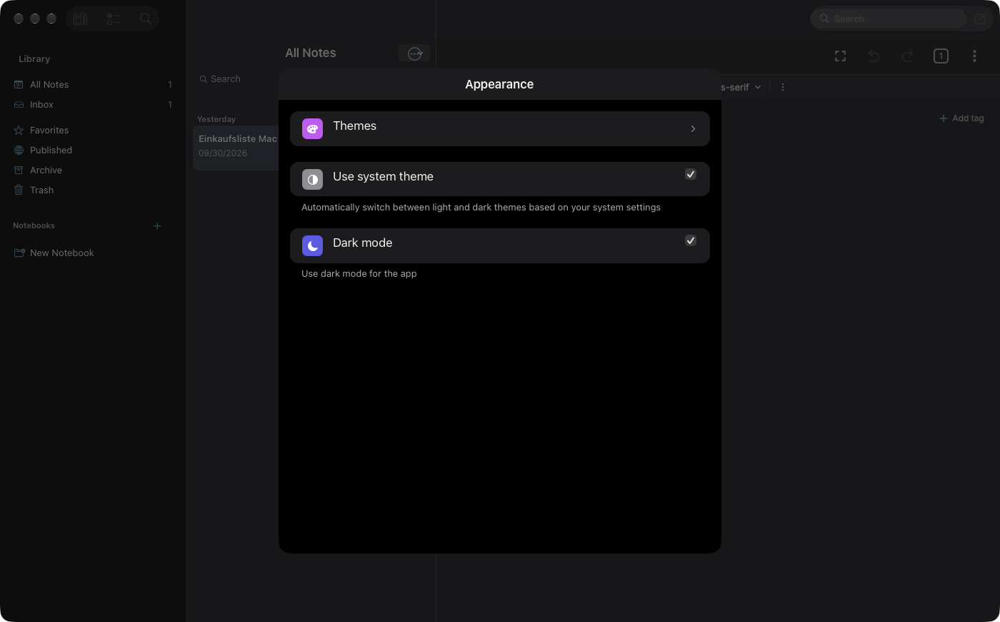
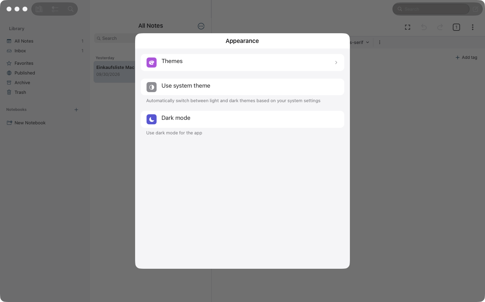
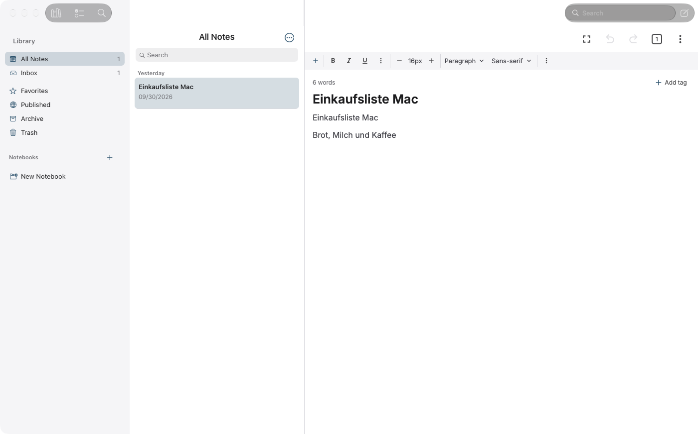
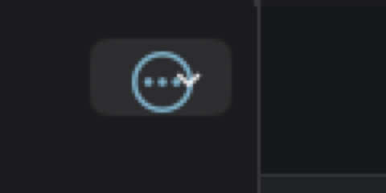

# WP01 · Sichtbare Laufzeit-Fehler beheben

**Status:** erledigt (R18 Toolbar-Segmente und R20 offen dokumentiert) · **Befunde:** 8 (P1×5 · P2×2 · P3×1) · **Abhängig von:** —

## Ziel

Alle Fehler, die ein Nutzer sofort sieht, sind weg: Suche zeigt Inhalt, Einstellungen haben einen Rückweg, Checkboxen sind in beiden Themes sichtbar, die Toolbar passt zum Theme, VoiceOver-Labels stimmen.

## Screenshots (Ist-Zustand)

Mit dem Read-Tool ansehen, bevor du anfängst.

## Vorgehen

1. R11 zuerst reproduzieren: `tools/mac-app.sh menu View Search` und dann `shot`. Prüfen, ob die Fläche auch im aktiven Fenster leer bleibt (`screens/global-search/index.tsx`, Mac-Zweig `:176-181`).
2. R14: Header der Settings-Unterseiten (`screens/settings/`) bekommt auf dem Mac einen Zurück-Knopf. Im Accessibility-Baum muss er als Button auftauchen.
3. R16/R15: Checkbox-Rendering für Catalyst finden (`screens/settings/section-item.tsx:502,518`). Rahmen aus semantischem Token, vertikal zentrieren.
4. R9: Beim Theme-Wechsel `overrideUserInterfaceStyle` am UIWindow setzen (native Bridge, z. B. in `VeyraNMacMenu.m` oder `SceneDelegate.m`). Alternative mit Rückfrage: auf dem Mac nur „System“ anbieten.
5. R18: `accessibilityLabel` der Toolbar-Items in `VeyraNMacToolbar.m` setzen und in den Settings-Zeilen den Icon-Namen aus dem Label nehmen, Rolle `button`.
6. R17: Menüindikator am ⋮-Knopf über der Liste entfernen (`components/header/index.tsx` bzw. der native Menübutton).
7. R20 nur untersuchen und dokumentieren. Beheben, wenn die Ursache klar ist.

## Abnahmekriterien

- [x] `tools/mac-app.sh menu View Search` zeigt einen Leerzustand oder Ergebnisse, keine schwarze Fläche.
- [x] Settings › Appearance hat einen Zurück-Knopf. `tools/mac-app.sh press "Back"` (bzw. das gewählte Label) kehrt zurück.
- [x] Screenshot im hellen Theme zeigt leere Checkboxen mit Rahmen.
- [x] Helles App-Theme bei dunklem System: Toolbar ist hell.
- [~] `tools/mac-app.sh dump`: Settings-Zeilen heißen jetzt „Appearance“ usw. und sind Buttons (erledigt). Die drei Toolbar-Segmente heißen weiter „Books standing vertically on a shelf“ / „Checklist with checkmarks“ (Catalyst-Grenze, siehe R18).
- [x] Release-Build für Catalyst baut fehlerfrei (BUILD SUCCEEDED), iOS-Simulator-Build ebenso (arm64; der x86_64-Link von „Make Note“ scheitert wie schon bekannt).

## Befunde

#### R11 — Suchansicht komplett leer

- **Prio:** P1 · **Aufwand:** S · **Quelle:** Laufzeit (Screenshot)
- **Screenshot:** [03-search-empty.png](../screenshots/03-search-empty.png)
- **Befund:** Unter der Toolbar ist alles schwarz. Kein Suchfeld, kein Leerzustand, keine Spalten. Möglicherweise nur im nicht aktiven Fenster, das bitte einmal von Hand prüfen.
- **Fix:** Leerzustand („Suchbegriff in die Toolbar eingeben“) plus zuletzt gesuchte Begriffe. Bei Eingabe Ergebnisse in der Listen-Spalte zeigen, Sidebar sichtbar lassen.
- [x] erledigt

#### R14 — Kein Zurück-Knopf, kein „Done“

- **Prio:** P1 · **Aufwand:** S · **Quelle:** Laufzeit (Screenshot)
- **Screenshot:** [05-settings-appearance-no-back.png](../screenshots/05-settings-appearance-no-back.png)
- **Befund:** Die Unterseite hat nur den Titel. Raus geht es nur mit Esc. Beim Test ließ sich das Sheet ohne Tastatur nicht mehr schließen, die App musste neu gestartet werden.
- **Fix:** Zurück-Knopf in den Sheet-Kopf. Mit R13 erledigt sich das, weil ein Einstellungen-Fenster keine Navigationsstapel braucht.
- [x] erledigt

#### R16 — Nicht angehakte Checkboxen sind unsichtbar

- **Prio:** P1 · **Aufwand:** S · **Quelle:** Laufzeit (Screenshot)
- **Screenshot:** [06-settings-light-invisible-checkboxes.png](../screenshots/06-settings-light-invisible-checkboxes.png)
- **Befund:** Im hellen Theme hat das leere Kästchen weder Rahmen noch Fläche. Man sieht nicht, dass es hier etwas zum Anklicken gibt.
- **Fix:** Rahmenfarbe aus einem semantischen Token (separator / tertiaryLabel) statt aus der Hintergrundfarbe.
- [x] erledigt

#### R18 — Bedienungshilfen-Namen sind Symbolbeschreibungen

- **Prio:** P1 · **Aufwand:** S · **Quelle:** Laufzeit (Bedienungshilfen/Menü)
- **Befund:** VoiceOver liest die Toolbar-Knöpfe als „Books standing vertically on a shelf“ und „Checklist with checkmarks“. Einstellungszeilen heißen „format, Appearance, Forward“. Sie sind generische Elemente statt Buttons, Überschriften kommen doppelt.
- **Fix:** Echte Labels setzen („Bibliothek“, „Aufgaben“), Icon-Namen aus dem Label entfernen, Zeilen als Button markieren (`accessibilityRole="button"`).
- [~] teilweise: Settings-Zeilen sind Buttons mit echtem Namen, Dekor ist für VoiceOver verborgen. Die Toolbar-Segmente behalten die Symbolbeschreibung (siehe Ergebnis).

#### R9 — Toolbar folgt dem App-Theme nicht

- **Prio:** P1 · **Aufwand:** S · **Quelle:** Laufzeit (Screenshot)
- **Screenshot:** [07-main-light-toolbar-mismatch.png](../screenshots/07-main-light-toolbar-mismatch.png)
- **Befund:** Ist die App hell und das System dunkel, bleiben Segment, Suchfeld und Ampeln dunkel. Die Fensterleiste passt nicht zum Inhalt.
- **Fix:** Beim Theme-Wechsel `overrideUserInterfaceStyle` am UIWindow setzen. Einfacher und Mac-typischer: auf dem Mac nur „System“ anbieten.
- [x] erledigt

#### R15 — Checkboxen oben statt mittig

- **Prio:** P2 · **Aufwand:** S · **Quelle:** Laufzeit (Screenshot)
- **Screenshot:** [05-settings-appearance-no-back.png](../screenshots/05-settings-appearance-no-back.png)
- **Befund:** Die Häkchenfelder sitzen an der Oberkante der Zeile, nicht auf der Textlinie.
- **Fix:** Vertikal zentrieren oder auf dem Mac einen Schalter rechts in der Zeile verwenden (C5).
- [x] erledigt

#### R17 — Überlagertes Häkchen und graue Fläche

- **Prio:** P2 · **Aufwand:** S · **Quelle:** Laufzeit (Screenshot)
- **Screenshot:** [10-list-more-button-zoom.png](../screenshots/10-list-more-button-zoom.png)
- **Befund:** Über dem Kreis-Symbol liegt ein zweites Glyph (Häkchen bzw. Pull-down-Pfeil). Im dunklen Modus hat der Knopf eine graue Fläche, im hellen nicht.
- **Fix:** Den Catalyst-Menüindikator ausblenden (`showsMenuAsPrimaryAction` mit `preferredBehavioralStyle = .pad` oder eigenes Symbol ohne Indikator) und den Hintergrund für beide Themes gleich behandeln.
- [x] erledigt

#### R20 — Liste springt um ca. 20 pt

- **Prio:** P3 · **Aufwand:** S · **Quelle:** Laufzeit (Bedienungshilfen/Menü)
- **Befund:** Die Zeile „Yesterday“ stand einmal bei y = 147, nach Sheet bzw. Neustart bei y = 167. Ursache unklar, vermutlich ein Safe-Area- oder Insets-Wechsel.
- **Fix:** Insets der Listenspalte auf dem Mac fest setzen statt Safe-Area-abhängig.
- [~] untersucht, nicht behoben (siehe Ergebnis)

## Regeln für jedes Paket

- Lies zuerst [`../CONTEXT.md`](../CONTEXT.md) (Build, Prüfung, Fallstricke, Git-Regeln).
- Nur Mac-Catalyst-Pfade ändern: `isMacCatalyst()` in JS, `#if TARGET_OS_MACCATALYST` bzw. `targetEnvironment(macCatalyst)` nativ. iPhone und iPad dürfen sich nicht verändern. Android ignorieren.
- Belege mit `datei:zeile` stammen aus dem Code-Audit vom 1. Okt. 2026. Zeilen können sich verschoben haben, also vor dem Ändern nachlesen.
- Kein Computer Use und keine Desktop-Screenshots. Prüfen nur mit `tools/mac-app.sh` (App im Hintergrund, nur App-Fenster). Neue Screenshots als `screenshots/<WPxx>-after-<name>.png` ablegen.
- Am Ende: Checkboxen in dieser Datei und die Statuszeile in [`../PLAN.md`](../PLAN.md) aktualisieren und ein kurzes Ergebnis unter „Ergebnis“ eintragen.

## Ergebnis

Umgesetzt am 1. Okt. 2026 (DeepSeek-Jobs, vom Supervisor geprüft). Nichts committet.

| Befund | Ergebnis |
|---|---|
| R11 Suche leer | `screens/global-search/index.tsx`: Mac-Leerzustand (Lupe, Titel, Hinweis) plus zuletzt gesuchte Begriffe (max. 8, nur bei Return gespeichert, MMKV-Key `globalSearchRecents`, `search-recents.ts` mit Tests, `stores/use-global-search-store.ts`). Screenshot `WP01-after-search.png`. |
| R14 Zurück | `components/header/index.tsx`: auf dem Mac erscheint der Zurück-Knopf für Header mit `renderedInRoute="Settings"`. Die Mac-Notizliste bleibt ohne. `WP01-after-appearance-*.png`. |
| R16/R15 Checkboxen | `screens/settings/section-item.tsx`: neue `MacCheckbox` (Rahmen aus `visual.tertiaryText`, vertikal mittig) statt des RN-`Switch`, der auf Catalyst als Checkbox ohne Rahmen gezeichnet wurde. Schalten übernimmt weiter die Zeile. |
| R9 Toolbar-Theme | Neue native Methode `VeyraNMacMenu.setWindowAppearance` (`overrideUserInterfaceStyle` auf allen Fenstern, Wert wird gemerkt und in `SceneDelegate.m` auf neue Fenster angewendet). JS: `utils/mac-window-appearance.ts`, aufgerufen im Theme-Effekt von `app.tsx`, reagiert auch auf „Use system theme“. Geprüft: helle App bei dunklem System zeigt helle Toolbar. |
| R17 ⋮-Knopf | `VeyraNMenu.swift`: auf Catalyst `preferredBehavioralStyle = .pad`, Titel/Bild leer, Pointer-Interaktion aus. Kein überlagertes Häkchen mehr (`WP01-after-more-button-zoom.png`). Der Pointer-Cursor auf dem Knopf fehlt damit, das gehört zu C6/WP11. |
| R18 Bedienungshilfen | Settings-Zeilen: `accessibilityRole` button/switch, Label = Zeilenname, Symbol-Kachel und Chevron für VoiceOver verborgen. Im AX-Dump jetzt „Appearance“, „Use system theme“ usw. **Offen:** die Toolbar-Segmente heißen weiter nach der SF-Symbol-Beschreibung. Mit den öffentlichen Catalyst-Headern gibt es keine Accessibility-Eigenschaft für `NSToolbarItem`. Einzige noch ungeprüfte Idee: Symbol als Bitmap (`UIGraphicsImageRenderer`, Template) statt `systemImageNamed` laden. Gehört zu WP02, wenn die Toolbar ohnehin umgebaut wird. |
| R20 Listensprung | Ursache sehr wahrscheinlich `macToolbarInset` (`utils/mac-layout.ts:64`): solange UIKit den oberen Safe-Area-Inset noch mit 0 meldet, gilt die Konstante 52 pt, danach der echte Wert (Unterschied ≈ 20 pt). Nicht behoben, weil der richtige feste Wert erst mit den Messungen von WP02 (W8, Toolbar-Höhe) feststeht. Dort gleich mitnehmen. |

Prüfung: `tsc` ohne neue Fehler, Jest `global-search` und `mac-window-appearance` grün (13 Tests). `account-section.test.tsx` scheitert unabhängig davon schon vorher an der Importkette `ios-appearance` → `biometrics` (ESM-Import in Jest). Catalyst-Release-Build und iOS-Simulator-Build erfolgreich. Theme nach dem Test wieder auf „Use system theme“ zurückgestellt.
