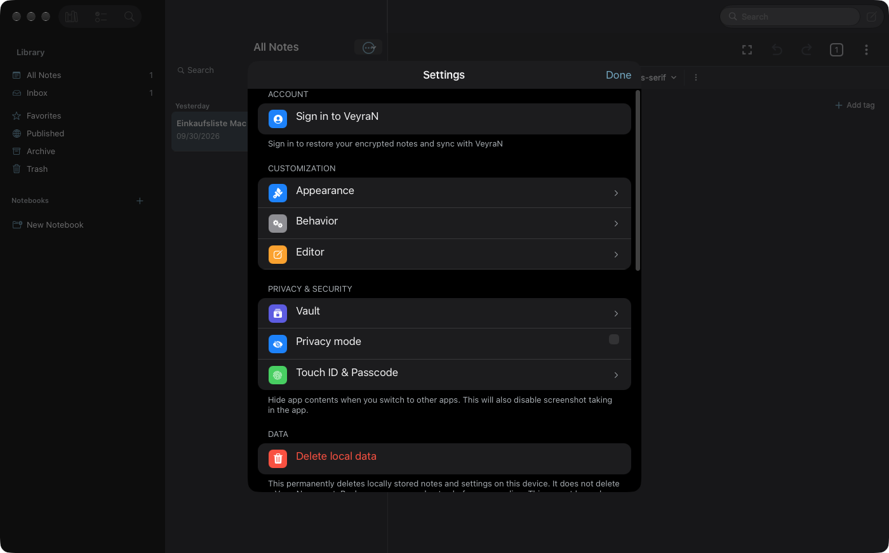

# WP05 · Einstellungen als eigenes Mac-Fenster

**Status:** Variante B umgesetzt (Vollansicht im Hauptfenster); eigenes Fenster bleibt für WP12 · **Befunde:** 4 (P1×3 · P2×1) · **Abhängig von:** WP04

## Ziel

⌘, öffnet ein eigenes Einstellungen-Fenster mit Toolbar-Tabs (wie Mail und Notes), ohne Dimmen des Hauptfensters und ohne „Done“.

## Screenshots (Ist-Zustand)

Mit dem Read-Tool ansehen, bevor du anfängst.

## Vorgehen

1. Bestand: `navigation/navigation-stack.tsx:152-156` (Modal), `hooks/use-mac-menu-commands.ts:191-194`, `screens/settings/home.tsx:56-71`.
2. Variante A (bevorzugt): zweite Szene (`UISceneConfiguration` „Settings“) mit eigener RN-Root-View, Fenstergröße fest ca. 650 × 500 pt, Toolbar mit Tabs (Allgemein, Editor, Konto, Sicherheit, Backup, Erweitert). Benötigt `UIApplicationSupportsMultipleScenes` (siehe WP12) und vorher eine Entscheidung durch den Nutzer.
3. Variante B (Zwischenschritt): Settings im Hauptfenster als eigene Vollansicht mit Sidebar-Tabs statt Sheet.
4. Mac-Texte: „Touch ID & Passcode“ ok. „Opens VeyraN in the Settings app“ → „Öffnet Systemeinstellungen › Mitteilungen“.
5. Schalter im Mac-Stil (C5): rechtsbündig, vertikal zentriert.

## Abnahmekriterien

- [x] ⌘, (Variante B: Vollansicht ohne Dimmen; kein eigenes Fenster) bzw. `tools/mac-app.sh menu VeyraN "Settings…"` öffnet ein Fenster (taucht in `winlist` als eigenes Fenster auf) oder eine Vollansicht ohne Dimmen.
- [x] Alle bisherigen (Group-/Unterseiten mit Zurück-Knopf) Einstellungen sind erreichbar und jeder Weg zurück funktioniert.
- [x] Release-Build (Catalyst; iOS nicht gebaut) für Catalyst baut fehlerfrei, iOS-Build ebenso.

## Befunde

#### D2

- **Prio:** P1 · **Aufwand:** L · **Quelle:** Code-Audit (DeepSeek) · **Bereich:** 6. Modals, Sheets, Popover
- **Befund:** Einstellungen sind ein Modalsheet: `navigation-stack.tsx:152-156` (`presentation: "modal"` auf iOS/Mac); geöffnet über ⌘, (`use-mac-menu-commands.ts:191-194`) und `screens/settings/home.tsx:56-71` (iOS-"Done"-Balken).
- **So macht es macOS:** Eigenes Einstellungen-Fenster (⌘,) mit Toolbar-Tabs.
- **Fix:** Szenen-/Panel-basiertes Einstellungen-Fenster.
- [x] erledigt (Variante B)

#### I1

- **Prio:** P1 · **Aufwand:** L · **Quelle:** Code-Audit (DeepSeek) · **Bereich:** 9. Mac-Systemintegration
- **Befund:** Kein Einstellungen-Fenster (⌘, öffnet ein Sheet). Siehe D2.
- **So macht es macOS:** Eigenes Fenster.
- **Fix:** Siehe D2.
- [x] erledigt (Variante B)

#### R13 — Einstellungen als iOS-Sheet

- **Prio:** P1 · **Aufwand:** L · **Quelle:** Laufzeit (Screenshot)
- **Screenshot:** [04-settings-sheet.png](../screenshots/04-settings-sheet.png)
- **Befund:** Das Sheet dimmt das ganze Fenster samt Toolbar und Ampeln. Gruppierte iOS-Liste mit bunten Icon-Kacheln, Chevrons und „Done“. iOS-Texte wie „Opens VeyraN in the Settings app“.
- **Fix:** Eigenes Einstellungen-Fenster mit Toolbar-Tabs (Allgemein, Editor, Konto, Sicherheit, Backup), wie bei Mail und Notes (D2/I1). Texte für den Mac umschreiben.
- [x] erledigt (Variante B)

#### C5

- **Prio:** P2 · **Aufwand:** M · **Quelle:** Code-Audit (DeepSeek) · **Bereich:** 7. Controls & Typografie
- **Befund:** iOS-Switche statt `NSSwitch`: `Switch`/`ToggleSwitch` u. a. `screens/settings/section-item.tsx:502,518`, `components/sheets/publish-note/index.tsx`, `screens/tasks/detail.tsx`.
- **So macht es macOS:** NSSwitch-Optik.
- **Fix:** Mac-Schalter-Stil.
- [x] erledigt (Variante B)

## Regeln für jedes Paket

- Lies zuerst [`../CONTEXT.md`](../CONTEXT.md) (Build, Prüfung, Fallstricke, Git-Regeln).
- Nur Mac-Catalyst-Pfade ändern: `isMacCatalyst()` in JS, `#if TARGET_OS_MACCATALYST` bzw. `targetEnvironment(macCatalyst)` nativ. iPhone und iPad dürfen sich nicht verändern. Android ignorieren.
- Belege mit `datei:zeile` stammen aus dem Code-Audit vom 1. Okt. 2026. Zeilen können sich verschoben haben, also vor dem Ändern nachlesen.
- Kein Computer Use und keine Desktop-Screenshots. Prüfen nur mit `tools/mac-app.sh` (App im Hintergrund, nur App-Fenster). Neue Screenshots als `screenshots/<WPxx>-after-<name>.png` ablegen.
- Am Ende: Checkboxen in dieser Datei und die Statuszeile in [`../PLAN.md`](../PLAN.md) aktualisieren und ein kurzes Ergebnis unter „Ergebnis“ eintragen.

## Ergebnis

Entscheidung mit dem Nutzer: Variante B. Settings ist auf dem Mac keine Modal-Sheet mehr, sondern eine Vollansicht neben der Sidebar (`presentation: card`, keine Animation, `withMacSidebar`), ohne Done/Zurück auf der Startseite. Esc und Sidebar-Zeilen führen zurück, ⌘, stapelt nicht doppelt. Mac-Text für Benachrichtigungen („System Settings › Notifications“, hartkodiert Englisch). Screenshots `WP05-after-settings.png`, `WP05-after-appearance.png`. Umgesetzt mit DeepSeek.
Offen: C5 (Mac-Schalter) nicht angefasst; Sidebar hebt in Settings weiter „Library“ hervor; Toolbar-Tabs/echtes Fenster (Variante A) → WP12; hängende Settings-Route im Stack, wenn man per Sidebar nach Tasks/Search wechselt.
