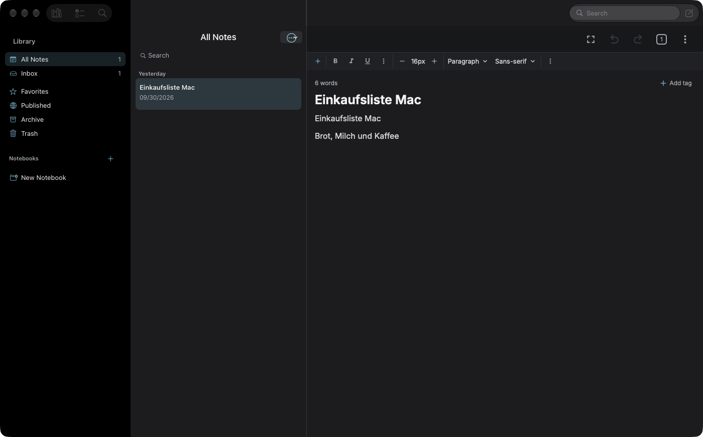
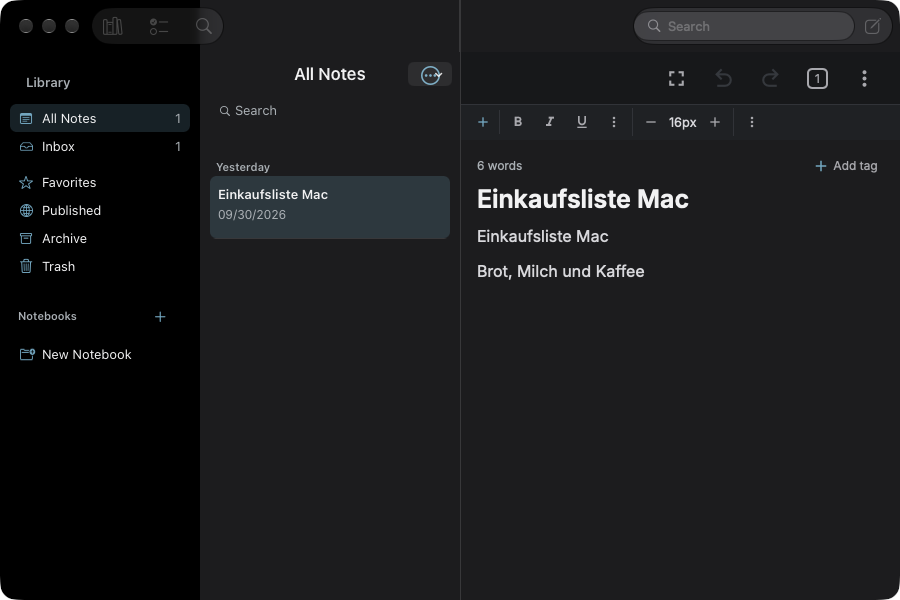

# WP08 · Editor wie Notes: Textspalte, Aa-Format, Suchen

**Status:** Teil A (Textspalte), B1 (Format-/Find-Menü) und B2a (Aa-Formatleiste) umgesetzt; DnD aus B2 offen · **Befunde:** 10 (P1×5 · P2×4 · P3×1) · **Abhängig von:** WP02, WP10

## Ziel

Zentrierte Textspalte, Mac-Typografie, Format über Toolbar-Popover und das Format-Menü, ⌘F und ⌥⌘F im Text, Drag & Drop von Dateien.

## Screenshots (Ist-Zustand)

Mit dem Read-Tool ansehen, bevor du anfängst.

## Vorgehen

1. WebView-Editor: `packages/editor-mobile/src/components/editor.tsx:480,596-612`, `title.tsx:97-120`, `utils/mac.ts`. Bei `isMacCatalyst`: `max-width: 46rem; margin: 0 auto`, Titel ca. 22 pt.
2. Formatleiste auf dem Mac durch „Aa“-Toolbar-Item mit Popover ersetzen (Titel, Überschrift, Unterüberschrift, Text, Monospace, Listen, Checkliste). Keine „px“-Angaben.
3. Format-Menü (`AppDelegate.mm:241-386`) um Stile und Listen erweitern, Kommandos per Emitter an den Editor (E3/K2).
4. Edit › Find: Find…, Find & Replace, Next/Previous an `packages/editor/src/toolbar/popups/search-replace.tsx` binden (E4/K3).
5. Wortzahl und „Add tag“ aus der Kopfzeile in Info-Popover bzw. unter den Text (R7). Drop von Bildern und Dateien (E7).
6. Editor-Bundle bauen: `npm run tx editor-mobile:build`.

## Abnahmekriterien

- [ ] Bei 1400 pt Fensterbreite ist die Textspalte zentriert und ≤ ca. 740 pt.
- [ ] ⌘F öffnet Suchen im Text, ⌥⌘F Suchen & Ersetzen.
- [ ] Format › Überschrift setzt eine Überschrift. ⌘B, ⌘I, ⌘U wirken.
- [ ] Bild aus dem Finder in die Notiz ziehen fügt es als Anhang ein.
- [ ] Release-Build für Catalyst baut fehlerfrei, iOS-Build ebenso.

## Befunde

#### E1

- **Prio:** P1 · **Aufwand:** S · **Quelle:** Code-Audit (DeepSeek) · **Bereich:** 4. Editor
- **Befund:** Keine maximale Textbreite/zentrierte Spalte: `editor-mobile/src/components/editor.tsx:480` (`maxWidth:"100vw"`), 12 px Padding (`:596-612`), Titel 100 % (`title.tsx:120`).
- **So macht es macOS:** macOS Notizen begrenzt die Textspalte (~600-700 pt, zentriert).
- **Fix:** Im WebView bei `isMacCatalyst` `max-width: 46rem; margin: 0 auto`.
- [~] erledigt (Teil A: zentrierte Spalte in `editor.tsx`/`title.tsx`; nicht build-verifiziert)

#### E3

- **Prio:** P1 · **Aufwand:** M · **Quelle:** Code-Audit (DeepSeek) · **Bereich:** 4. Editor
- **Befund:** Laufzeit: Das Format-Menü existiert als UIKit-Standard (Font: Bold, Italic, Underline, Bigger, Smaller, Show Colors; Text: Ausrichtung). `AppDelegate.mm:241-386` verdrahtet es nicht mit dem WKWebView-Editor. Absatzstile, Listen und Checklisten fehlen. Ob ⌘B/⌘I im WebView greifen: *unverifiziert*.
- **So macht es macOS:** Format > Fett/Kursiv/Unterstrichen + Absatzstile mit ⌘B/⌘I/⌘U.
- **Fix:** `UIMenuFormat`-Befehle ergänzen, die `VeyraNMacMenu`-Kommandos an den Editor senden. *Laufzeit unverifiziert.*
- [ ] erledigt

#### E4

- **Prio:** P1 · **Aufwand:** M · **Quelle:** Code-Audit (DeepSeek) · **Bereich:** 4. Editor
- **Befund:** Kein Suchen/Ersetzen in der Notiz: nur "Find in Notes" (⌘⇧F, `AppDelegate.mm:279-291`) und ein Toolbar-Eintrag `startSearch()` (`editor-mobile/src/components/header.tsx:393`). Ersetzen existiert (`packages/editor/src/toolbar/popups/search-replace.tsx`), aber ohne Shortcut.
- **So macht es macOS:** ⌘F suchen, ⌘⌥F Suchen & Ersetzen, ↩/⇧↩ navigieren.
- **Fix:** Edit-Menü Find/Find & Replace → Editor-Commands, `Cmd-F`-Keymap im WebView.
- [ ] erledigt

#### K2

- **Prio:** P1 · **Aufwand:** M · **Quelle:** Code-Audit (DeepSeek) · **Bereich:** 5. Menüs & Tastatur
- **Befund:** Format-Menü nicht abgedeckt. Siehe E3.
- **So macht es macOS:** Format-Menü für Text.
- **Fix:** Siehe E3.
- [ ] erledigt

#### K3

- **Prio:** P1 · **Aufwand:** M · **Quelle:** Code-Audit (DeepSeek) · **Bereich:** 5. Menüs & Tastatur
- **Befund:** Keine Suchen/Ersetzen-Kürzel im Edit-Menü. Siehe E4.
- **So macht es macOS:** ⌘F / ⌘⌥F.
- **Fix:** Siehe E4.
- [ ] erledigt

#### E2

- **Prio:** P2 · **Aufwand:** S · **Quelle:** Code-Audit (DeepSeek) · **Bereich:** 4. Editor
- **Befund:** Titel 25 pt hartkodiert, keine Mac-Größe: `title.tsx:97,119`.
- **So macht es macOS:** Mac-Titel ~17-22 pt (oder im Fenstertitel).
- **Fix:** Mac-Titelgröße über `settings.isMacCatalyst`.
- [~] erledigt (Teil A: 22 pt/700 mit passender Zeilenhöhe in `title.tsx`; nicht build-verifiziert)

#### E7

- **Prio:** P2 · **Aufwand:** M · **Quelle:** Code-Audit (DeepSeek) · **Bereich:** 4. Editor
- **Befund:** Kein Drag&Drop von Dateien/Bildern in den Editor: kein `onDrop`/`dragOver` (Grep: 0).
- **So macht es macOS:** Bilder/Dateien ziehen, Vorschau, Drop-Ziel.
- **Fix:** DnD-Handler im WebView + `EditorEvents.attachment`.
- [ ] erledigt

#### R6 — Formatleiste im Web-Stil

- **Prio:** P2 · **Aufwand:** M · **Quelle:** Laufzeit (Screenshot)
- **Screenshot:** [01-main-dark.png](../screenshots/01-main-dark.png)
- **Befund:** Schrittregler „16px“, Dropdowns „Paragraph“ und „Sans-serif“, zwei ⋮-Menüs.
- **Fix:** Wie Notes: ein „Aa“-Knopf in der Toolbar mit Popover (Titel, Überschrift, Text, Listen) plus vollständiges Format-Menü. Keine Pixelangaben in der Oberfläche.
- [~] erledigt (Teil B2a: Mac-Toolbar-Definition `MAC_TOOLBAR_GROUPS` + `macFormat`-Tool; Build und Laufzeit vom Supervisor zu prüfen; nicht build-verifiziert)

#### R7 — Editor ohne Textspalte

- **Prio:** P2 · **Aufwand:** S · **Quelle:** Laufzeit (Screenshot)
- **Screenshot:** [01-main-dark.png](../screenshots/01-main-dark.png)
- **Befund:** Text klebt links an der Spalte. „6 words“ und „Add tag“ stehen als eigene Inhaltszeile über dem Titel.
- **Fix:** Zentrierte Textspalte mit max. ca. 700 pt (E1). Wortzahl in die Statusanzeige oder ins Info-Popover, Tags unter den Text.
- [~] erledigt (Teil A: Wortzahl-/„Add tag“-Zeile auf die zentrierte Spalte ausgerichtet; Verschieben in Statusanzeige/Info-Popover offen; nicht build-verifiziert)

#### E9

- **Prio:** P3 · **Aufwand:** S · **Quelle:** Code-Audit (DeepSeek) · **Bereich:** 4. Editor
- **Befund:** Rechtschreibprüfung vorhanden (`editor.tsx:487`), Textsubstitutionen/Datenprüfer nicht erkennbar.
- **So macht es macOS:** macOS-Substitutionen greifen im Textfeld.
- **Fix:** `WKWebView`-Konfiguration prüfen. *unverifiziert.*
- [ ] erledigt

## Regeln für jedes Paket

- Lies zuerst [`../CONTEXT.md`](../CONTEXT.md) (Build, Prüfung, Fallstricke, Git-Regeln).
- Nur Mac-Catalyst-Pfade ändern: `isMacCatalyst()` in JS, `#if TARGET_OS_MACCATALYST` bzw. `targetEnvironment(macCatalyst)` nativ. iPhone und iPad dürfen sich nicht verändern. Android ignorieren.
- Belege mit `datei:zeile` stammen aus dem Code-Audit vom 1. Okt. 2026. Zeilen können sich verschoben haben, also vor dem Ändern nachlesen.
- Kein Computer Use und keine Desktop-Screenshots. Prüfen nur mit `tools/mac-app.sh` (App im Hintergrund, nur App-Fenster). Neue Screenshots als `screenshots/<WPxx>-after-<name>.png` ablegen.
- Am Ende: Checkboxen in dieser Datei und die Statuszeile in [`../PLAN.md`](../PLAN.md) aktualisieren und ein kurzes Ergebnis unter „Ergebnis“ eintragen.

## Ergebnis

_(nach Abschluss ausfüllen: was geändert wurde, Commits, offene Punkte)_

### Ergebnis (Teil A)

Teil A (zentrierte Textspalte, Mac-Titeltypografie, Kopfzeile an der Spalte) ist implementiert. Das Editor-Bundle baut der Supervisor (`npm run tx editor-mobile:build`), deshalb sind E1, E2 und R7 nur mit `[~]` markiert: eslint/prettier sind grün, aber im laufenden Catalyst-Build ist nichts davon verifiziert.

- **Neue Mac-Metriken** in `packages/editor-mobile/src/utils/mac.ts`: `MAC_TEXT_COLUMN_MAX_WIDTH = "46rem"`, `MAC_TEXT_COLUMN_PADDING = 24`, `MAC_TITLE_FONT_SIZE = 22`, `MAC_TITLE_LINE_HEIGHT = 28`.
- **E1/R7 – Textspalte** (`packages/editor-mobile/src/components/editor.tsx`): Der Editor-Inhalt (`getContentDiv`, die ProseMirror-Wurzel) bekommt auf dem Mac `max-width: 46rem`, `margin: 0 auto`, 24 px horizontales Padding, `box-sizing: border-box` und `overflow-x: auto`, damit breite Tabellen/Codeblöcke in der Spalte scrollen statt das Layout zu verschieben. Die Zeile mit Wortzahl und „+ Add tag“ ist auf dem Mac über `max-width`/`margin: 0 auto`/24 px ebenfalls auf dieselbe Spalte ausgerichtet. Formatleiste (weiterhin `left: 0; right: 0` in `tiptap.tsx`) und die Kopfzeile (auf dem Mac `null`) bleiben unverändert voll breit.
- **E2 – Titel** (`packages/editor-mobile/src/components/title.tsx`): Auf dem Mac 22 pt, Gewicht 700, `line-height: 28px`; der unsichtbare Mess-Div nutzt exakt dieselben Werte, damit das Auto-Grow des Textareas unverändert funktioniert. Der Titel hat außerdem dieselbe zentrierte 46-rem-Spalte wie der Text. iPhone, iPad und Android behalten 25 pt/600 bei voller Breite.
- Alle Änderungen hängen an `settings.isMacCatalyst` bzw. `globalThis.isMacCatalyst` (WebView-Injection, siehe `apps/mobile/app/screens/editor/index.tsx:181`); ohne das Flag ist der Pfad unverändert.
- **Prüfung:** `prettier --check` sauber; ESLint mit der Repo-Config: 0 Fehler, nur die zwei vorbestehenden Warnungen (`insets`, `e` in `editor.tsx`); `tsc` konnte in diesem isolierten Checkout nicht laufen (keine `node_modules`).
- **Offen (Teil B):** „Aa“-Toolbar-Popover statt Web-Formatleiste (E3/K2/R6), ⌘F/⌥⌘F (E4/K3), Drag & Drop von Dateien (E7), Wortzahl/Tags ins Info-Popover bzw. unter den Text.

### Ergebnis (Teil B2a)

R6 ist über die vorhandene Toolbar-Definition umgesetzt, nicht per CSS: Auf dem Mac bekommt die Toolbar eine eigene Mac-Definition, die die Web-Elemente ersetzt. iPhone, iPad und Android lesen weiterhin `settings.tools` bzw. `getDefaultPresets()` und bleiben unverändert.

- **Mac-Definition** (`packages/editor/src/toolbar/tool-definitions.ts`): `MAC_TOOLBAR_GROUPS = [["macFormat"], ["checkList", "bulletList", "numberedList"]]` plus `getMacToolbarGroups()` (liefert eine Kopie, damit mehrere Editoren sich kein Array teilen). Neue Tool-Definition `macFormat` (Icon `heading`, Titel „Formatting“). Die Einfügen-Gruppe („+“) wird unverändert von der Toolbar vorangestellt (`MOBILE_STATIC_TOOLBAR_GROUPS`), Tabelle/Link/Anhang stecken wie bisher kontextabhängig darin.
- **„Aa“-Popover** (`packages/editor/src/toolbar/tools/mac-format.tsx`, neu): eigener Tool `MacFormat`, der das bestehende `Dropdown`-Popup wiederverwendet (dasselbe Menü wie „Headings“/„Font family“, inkl. Öffnen/Schließen und Auswahlzustand). Einträge: Title, Heading, Subheading, Body, Monospaced, dann Fett/Kursiv/Unterstrichen/Durchgestrichen, dann Aufzählung/Nummerierung/Checkliste. Jeder Eintrag ruft exakt die Kommandos der vorhandenen Tools auf (`setHeading` inkl. Zurücksetzen des `textStyle`-Overrides wie im Headings-Tool, `setParagraph`, `toggleCode`, `toggleBold/Italic/Underline/Strike`, `toggleBulletList/OrderedList/CheckList`). Title/Heading/Subheading mappen auf Heading 1/2/3, Body auf Absatz, Monospaced auf Inline-Code (im Schema vorhanden; Code-Block bleibt über das Einfügen-Menü erreichbar).
- **Anbindung** (`packages/editor-mobile/src/components/tiptap.tsx`): `tools={isMac ? getMacToolbarGroups() : …settings.tools}`. Damit sind auf dem Mac der „− 16px +“-Schrittregler, „Paragraph ▾“ und „Sans-serif ▾“ sowie die beiden ⋮-Gruppen aus `getDefaultPresets().default` weg; „px“ kommt in der Leiste nicht mehr vor.
- **Neue Strings** (`packages/intl/src/strings.ts`): `formatting`, `formatTitle`, `formatHeading`, `formatSubheading`, `formatBody`, `formatMonospaced`; Fett/Kursiv/Listen nutzen die vorhandenen Strings. Fehlende Übersetzungen fallen auf Englisch zurück (msgid).
- **Prüfung:** `prettier --check` mit der Repo-Version 2.8.8 auf allen geänderten Dateien sauber (`strings.ts` hat drei vorbestehende, nicht von dieser Änderung stammende Abweichungen in anderen Zeilen). ESLint/`tsc` konnten in diesem isolierten Checkout nicht laufen (keine `node_modules`); der Build läuft beim Supervisor (`npm run tx editor-mobile:build`). Laufzeit auf Catalyst nicht verifiziert.
- **Offen:** Drag & Drop von Dateien/Bildern (E7), Wortzahl/Tags ins Info-Popover (R7-Rest), Laufzeitprüfung des Aa-Popovers (Klick, Auswahlzustand, Position unter dem Knopf).

### Ergebnis (Teil B1, Laufzeit)
Edit > Find (⌘F, ⌥⌘F, ⌘G, ⇧⌘G) und Format-Menü (Title, Heading, Subheading, Body, Listen, Checkliste, Block Quote, Code Block, Clear Formatting) sind gebaut und laufen (Menüleiste per Bedienungshilfen geprüft, nur ohne offene Notiz ausgegraut). Die Fett/Kursiv/Unterstrichen/Link-Einträge (⌘B/I/U/K) fehlen im Menü, vermutlich weil sie mit den System-Kürzeln des Font-Untermenüs kollidieren; ob ⌘B im Editor weiter wirkt, ist nicht per Tastatur geprüft. Format-Befehle selbst nicht ausgelöst.

### Korrektur nach Laufzeittest
Der erste B1-Stand lud den Editor nicht mehr (leere Fläche): ein Deep-Import von `link-popup.js` in `editor-mobile/src/utils/commands.ts` brach das Bundle. Link wird jetzt über ein synthetisches ⌘K-Tastaturereignis ausgelöst. B2a (Aa-Toolbar statt Absatz-/Schrift-Dropdowns und px-Stepper) läuft: `screenshots/WP08-after-toolbar.png`.
