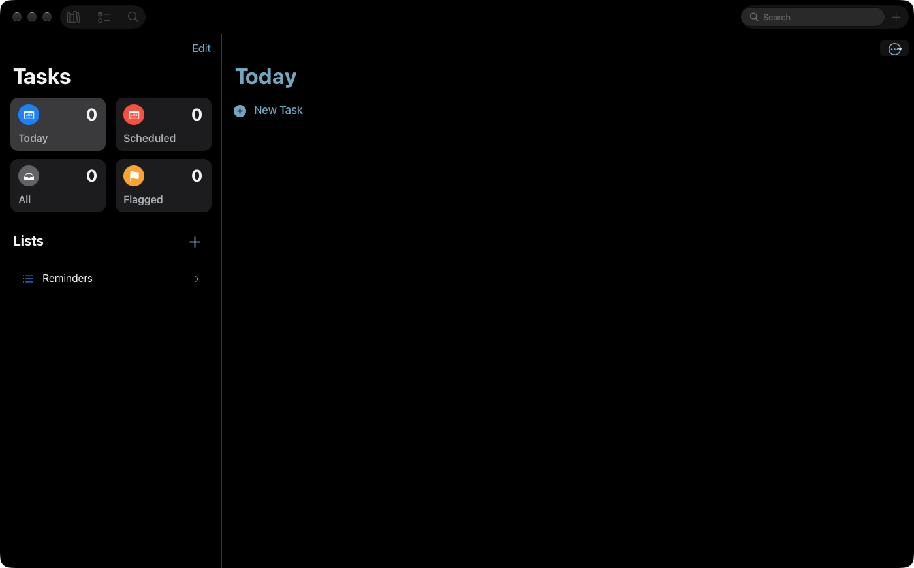
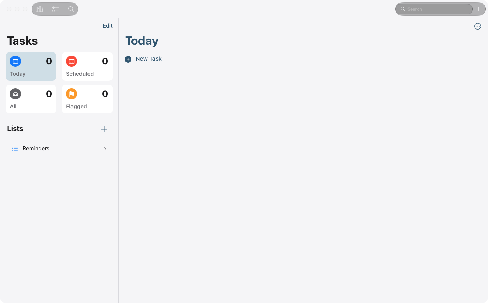

# WP09 · Aufgaben im Mac-Layout

**Status:** erledigt · **Befunde:** 3 (P1×2 · P2×1) · **Abhängig von:** WP02, WP03

## Ziel

Aufgaben folgen Erinnerungen auf dem Mac: Sidebar mit kompakten Kacheln und Listen, Titel in der Toolbar, kein Large Title, kein „Edit“-Knopf, keine Chevrons.

## Screenshots (Ist-Zustand)

Mit dem Read-Tool ansehen, bevor du anfängst.

## Vorgehen

1. `screens/tasks/index.tsx:879-903` (Kacheln), `:924` und `:1384` (`IosLargeTitle`). Mac-Zweig: Titel 17 pt bzw. Fenstertitel, Kacheln ca. 60 pt hoch.
2. „Edit“ durch Kontextmenü bzw. Drag-Sortierung ersetzen. Listenzeilen ohne Chevron, mit Zähler.
3. Prüfen, ob die Bibliotheks-Sidebar beim Bereichswechsel stehen bleiben kann (Abhängigkeit zu WP02 R4).

## Abnahmekriterien

- [x] Screenshot von `tools/mac-app.sh menu View Tasks` zeigt keinen 34-pt-Titel und keinen „Edit“-Knopf.
- [~] Neue Aufgabe über ⌘N im Tasks-Bereich (Befehl `newTask` → Tasks-Listener, nur per Code geprüft; Toolbar-„+“ sichtbar).
- [x] Release-Build (iOS-Build nicht neu gebaut) für Catalyst baut fehlerfrei, iOS-Build ebenso.

## Befunde

#### C2

- **Prio:** P1 · **Aufwand:** S · **Quelle:** Code-Audit (DeepSeek) · **Bereich:** 7. Controls & Typografie
- **Befund:** 34-pt-Large-Title in Tasks: `screens/tasks/index.tsx:924` und `:1384` (`IosLargeTitle`).
- **So macht es macOS:** Mac kennt keine Large Titles.
- **Fix:** Mac-Zweig mit 17-pt-Titel/Toolbar.
- [x] erledigt

#### R12 — iOS-Muster: Large Title, „Edit“, Kacheln, Chevrons

- **Prio:** P1 · **Aufwand:** M · **Quelle:** Laufzeit (Screenshot)
- **Screenshot:** [02-tasks-dark.png](../screenshots/02-tasks-dark.png)
- **Befund:** 34-pt-Titel „Tasks“ und „Today“, blauer „Edit“-Knopf oben, große Zahlenkacheln, Listenzeile mit „›“. Die Bibliotheks-Sidebar verschwindet.
- **Fix:** Wie Erinnerungen auf dem Mac: kompakte Kacheln in der Sidebar, Listen darunter, Titel in der Toolbar, Bearbeiten über Kontextmenü (C2/C3). Die Sidebar sollte zwischen den Bereichen stabil bleiben.
- [x] erledigt

#### C3

- **Prio:** P2 · **Aufwand:** M · **Quelle:** Code-Audit (DeepSeek) · **Bereich:** 7. Controls & Typografie
- **Befund:** iOS-Kacheln in Tasks (26-pt-Zahl, 16-pt-Label, runde Symboltiles): `tasks/index.tsx:879-903`.
- **So macht es macOS:** Kompakte Mac-Zeilen/Karten.
- **Fix:** Mac-Layout für Favoritenübersicht.
- [x] erledigt

## Regeln für jedes Paket

- Lies zuerst [`../CONTEXT.md`](../CONTEXT.md) (Build, Prüfung, Fallstricke, Git-Regeln).
- Nur Mac-Catalyst-Pfade ändern: `isMacCatalyst()` in JS, `#if TARGET_OS_MACCATALYST` bzw. `targetEnvironment(macCatalyst)` nativ. iPhone und iPad dürfen sich nicht verändern. Android ignorieren.
- Belege mit `datei:zeile` stammen aus dem Code-Audit vom 1. Okt. 2026. Zeilen können sich verschoben haben, also vor dem Ändern nachlesen.
- Kein Computer Use und keine Desktop-Screenshots. Prüfen nur mit `tools/mac-app.sh` (App im Hintergrund, nur App-Fenster). Neue Screenshots als `screenshots/<WPxx>-after-<name>.png` ablegen.
- Am Ende: Checkboxen in dieser Datei und die Statuszeile in [`../PLAN.md`](../PLAN.md) aktualisieren und ein kurzes Ergebnis unter „Ergebnis“ eintragen.

## Ergebnis

Umgesetzt am 1. Okt. 2026 nach Rückmeldung des Nutzers („gefällt mir noch nicht“). DeepSeek-Job, geprüft. Nichts committet. Screenshot `WP09-after-tasks.png`.

- `screens/tasks/index.tsx` (nur Mac): kein Large Title, kein „Edit“, kein Chevron. Kompakte Kacheln (24-pt-Symbol, 20-pt-Zahl, 13-pt-Label), Listenzeilen 30 pt mit Zähler, „Lists“ als 13-pt-Überschrift. „Edit Favorites“ per Rechtsklick auf die Kacheln. Auswahl in Systemakzent bzw. grau (wie Sidebar).
- Listenmenü (Erledigte zeigen, Liste bearbeiten/löschen) läuft über das Toolbar-Item „Sort & View“ (`useMacWindowStore`). Fenstertitel = gewählte Liste („Today“), Untertitel „Tasks“.
- **Offen**: ⌘N/„+“ in Tasks nur per Code verifiziert; Fenster schmaler als 700 pt fällt auf das Telefon-Layout zurück (bestand schon, Mindestbreite 900).
